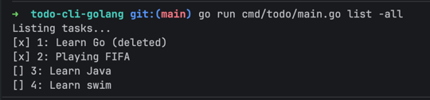

<h1>Todo Apps CLI</h1></br>

<p align="center">
  
</p>
This is command-line task manager written in Go, built to demonstrate idiomatic Go practices. </br>

## Available Command
- list
  - flag:
    - ["no arg2"] = default, only display active tasks
    - [-active] = display active tasks
    - [-done] = display done tasks
    - [-all] = display active and done tasks (including deleted task)
- add --> flag = -t
- done --> flag = -id
- delete --> flag = -id
- undo --> flag = -id

## Usage
go run main.go "command" "flag" "arg2 if required"

**i.e:**</br>
go run main.go add **-t** "Playing Point Blank"<br/>
go run main.go done **-id** 1</br>
go run main.go list</br>
go run main.go list **-all**

## Project Structure

```md

cmd/todo/            # Application entry point
internal/task/       # Business logic
internal/store/      # Persistence layer
models/              # Domain models
.github/workflows/   # CI configuration
